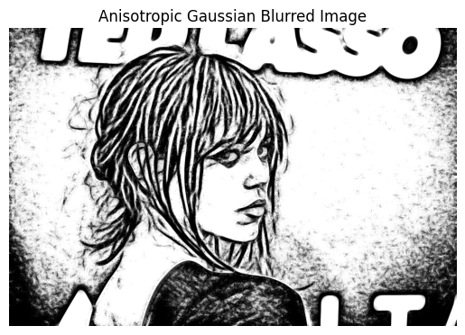
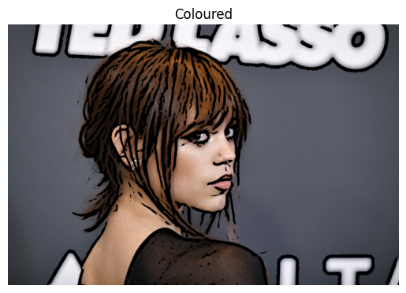
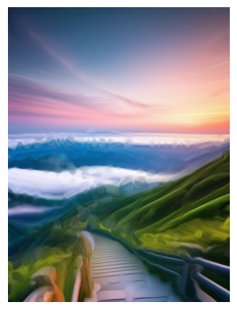

# Artistic Stylization and Cartoonization Using XDoG

## Project Overview

This project focuses on the artistic stylization and cartoonization of static color images using the Extended Difference of Gaussians (XDoG) technique. The implementation integrates edge flow-based filtering, line integral convolution, and color manipulation methods, such as k-means clustering and Van Gogh-inspired smearing, to produce visually captivating renditions like charcoal drawings, cartoons, and painterly effects.

## Example Outputs

Below are three example outputs generated using the techniques described in this project:

| **Charcoal Drawing** | **Cartoonized Image** | **Van Gogh-Style Painting** |
|-----------------------|-----------------------|-----------------------------|
|      |         |               |

## Features

### 1. **Artistic Edge Detection**
   - Utilizes the Difference of Gaussians (DoG) method for efficient edge extraction.
   - Enhanced with a hyperbolic tangent threshold for accentuating edges.
   
### 2. **Flow-Based Denoising**
   - Edge Tangent Flow (ETF) mapping for directional smoothing.
   - Line Integral Convolution (LIC) for edge smearing and noise reduction.

### 3. **Color Stylization**
   - **K-Means Clustering:** Simplifies colors for a cartoon-like aesthetic.
   - **Van Gogh-Style Painting:** Simulates brushstrokes by smearing color data using high-sigma Gaussian filters along ETF directions.

### 4. **GPU Acceleration**
   - Speeds up computationally intensive tasks with OpenCL.

## Installation and Requirements

### Prerequisites
- Python 3.x
- Dependencies:
  - `numpy`
  - `scipy`
  - `tqdm`
  - `pyopencl`

### Installation
1. Clone the repository:
   ```bash
   git clone <https://github.com/TumiJourdan/Image-Stylization.git>
